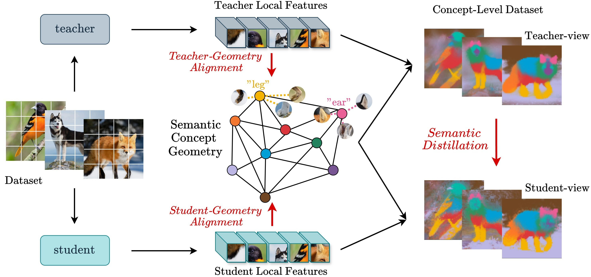

To download the weights for the  DINOv3 ViT-S* teacher model use the following command:
```bash
wget -O vit_small_patch16_dinov3.lvd1689m.bin https://huggingface.co/timm/vit_small_patch16_dinov3.lvd1689m/resolve/main/pytorch_model.bin
```

The following experiments reproduce the corresponding entries of Table 2 of our paper.

To train a ViT-T* using a DINOv3 ViT-S* pretrained teacher with the ConceptKD method, run this script:
```bash
python -m torch.distributed.run \
    --standalone \
    --nproc_per_node=4 \
    --master_port=29500 \
    main.py \
    --data-path /path/to/imagenet \
    --teacher-path ./vit_small_patch16_dinov3.lvd1689m.bin \
    --model vit_tiny_patch16_dinov3 \
    --teacher-model vit_small_patch16_dinov3 \
    --distillation-type soft \
    --distillation-alpha 0.0 \
    --w_concept 1 \
    --s-id 0 3 5 8 11 \
    --t-id 0 3 5 8 11 \
    --drop-path 0 \
    --batch-size 256 \
    --use-prototypes \
    --prototypes-number 3000 \
    --sigma 0.1 \
    --output_dir ./experiments/
```

To train the baseline for the ViT-T*, run this script:
```bash
python -m torch.distributed.run \
    --standalone \
    --nproc_per_node=4 \
    --master_port=29500 \
    main.py \
    --batch-size 256 \
    --drop-path 0 \
    --data-path /path/to/imagenet \
    --model vit_tiny_patch16_dinov3 \
    --output_dir ./experiments/
```

